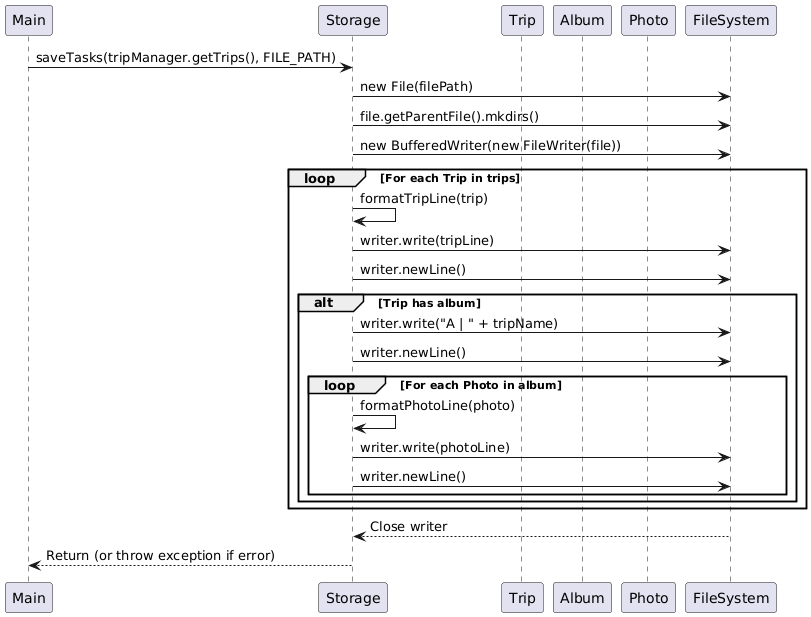
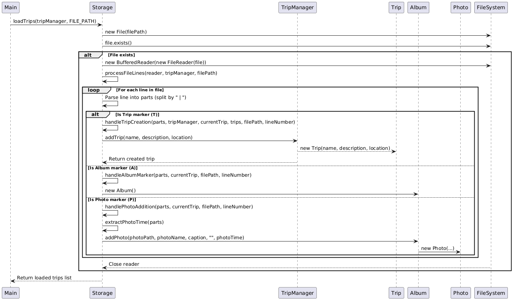

# Developer Guide

## Acknowledgements

{list here sources of all reused/adapted ideas, code, documentation, and third-party libraries -- include links to the original source as well}
## Product scope
### Target user profile

Roadtrippers, van lifers, backpackers, and long-distance drivers who want to document their journeys efficiently. These users value convenience, real-time tracking, and the ability to relive their trips through route history.

### Value proposition
The app enables roadtrippers to seamlessly track their journeys on the go. It automatically logs their geographical location, records mileage between stops, and helps them organize rest stops and key travel moments. By reducing manual input, it ensures that travelers can focus on their experience while still capturing essential trip details effortlessly.

## User Stories

|Version| As a ... | I want to ... | So that I can ...|
|--------|----------|---------------|------------------|
|v1.0|new user|see usage instructions|refer to them when I forget how to use the application|
|v2.0|user|find a to-do item by name|locate a to-do without having to go through the entire list|

## Non-Functional Requirements

{Give non-functional requirements}

## Glossary

* *glossary item* - Definition

## Instructions for manual testing

{Give instructions on how to do a manual product testing e.g., how to load sample data to be used for testing}

## Design & implementation

### Storage Component

#### Overview
The Storage component is responsible for reading and writing application data to persistent storage. It handles saving trip information, photos, and album metadata to a text file and loading this data back into the application when it starts.

#### Implementation
The Storage component is implemented as a utility class with static methods for saving and loading application data. It uses a text-based file format with markers to distinguish between different types of data (trips, albums, photos).

The main responsibilities of the Storage component are:
1. Saving trip data, including albums and photos, to a file
2. Loading trip data from a file into the application
3. Handling encoding and decoding of special characters in text data
4. Providing appropriate error handling for file operations

#### Key Operations

##### Saving Data
The saving process converts in-memory objects into a text representation and writes them to a file. The `saveTasks` method handles this process.

The sequence diagram above illustrates how the `saveTasks` method processes a list of Trip objects:

1. For each Trip, its details are formatted into a line with the "T" marker
2. If the Trip has an Album, the Album is written with the "A" marker
3. For each Photo in the Album, its details are formatted with the "P" marker
4. The formatted lines are written to the file

##### Loading Data
The loading process reads the text file line by line and reconstructs the in-memory objects. The `loadTrips` method handles this process.

The sequence diagram above shows how the `loadTrips` method works:

1. The file is read line by line
2. Each line is parsed based on its marker (T, A, or P)
3. For Trip lines (T), a new Trip is created using TripManager
4. For Album lines (A), the Album is associated with the current Trip
5. For Photo lines (P), a new Photo is created and added to the current Trip's Album
6. Special handling is implemented for errors to provide meaningful exceptions

#### Special Handling

##### Encoding and Decoding
The Storage component includes special handling for characters that might interfere with the file format:
- The pipe character (`|`) is encoded as `\pipe`
- Newline characters are encoded as `\newline`

This ensures that text containing these special characters can be correctly stored and retrieved.

##### Exception Handling
The component implements a comprehensive exception hierarchy to handle various error scenarios:
- `FileReadException`: When there are problems reading the data file
- `FileWriteException`: When there are problems writing to the data file
- `FileFormatException`: When the file format is invalid
- `TripLoadException`: When there are problems loading a specific Trip
- `PhotoLoadException`: When there are problems loading a specific Photo
- `PhotoSaveException`: When there are problems saving a specific Photo

These specialized exceptions provide detailed information about what went wrong and where, making debugging easier.

### PhotoPrinter

####
- Creates a **PhotoFrame** for displaying a **Photo**.
- Displays photos with captions, locations, and timestamps.
- Depends on **PhotoFrame** to handle the graphical display.
- Depends on **Photo** for retrieving image data and metadata.
- 

