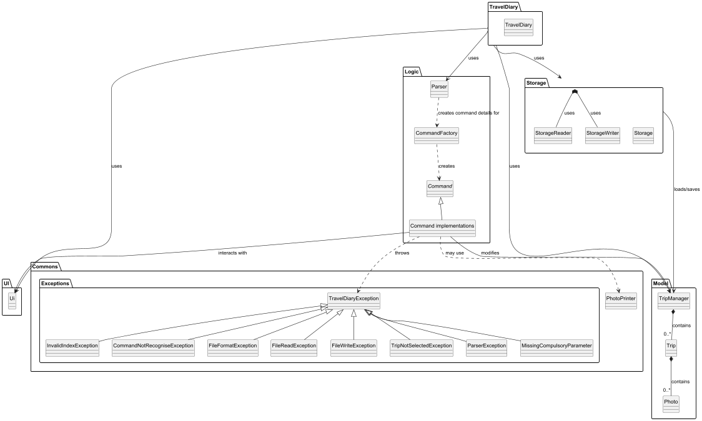
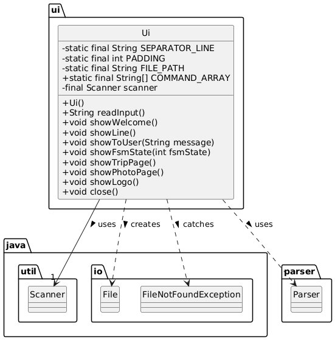
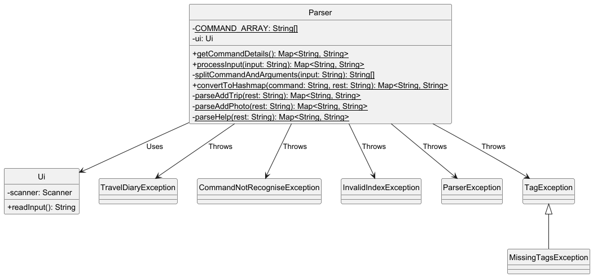
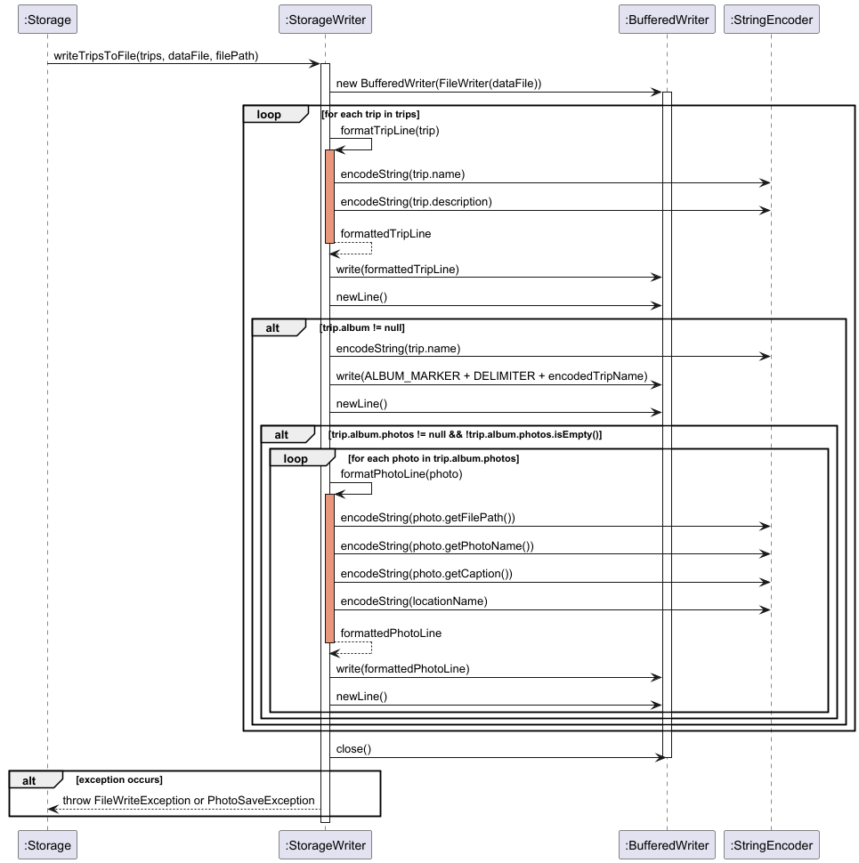
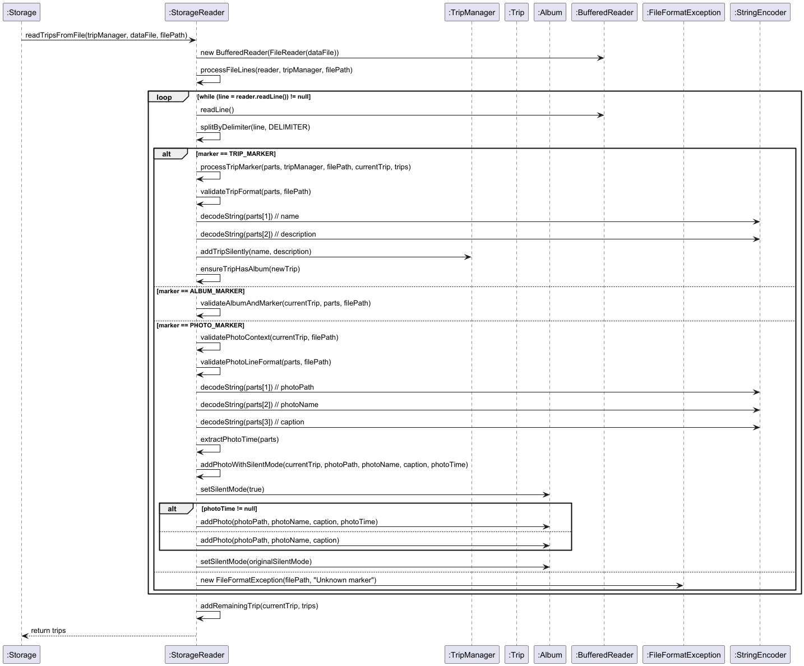
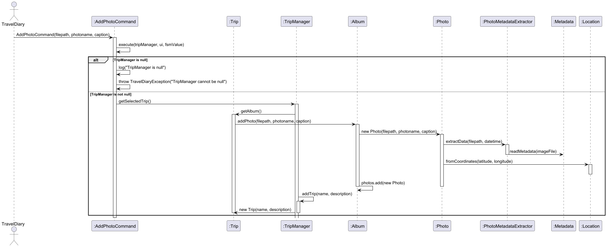
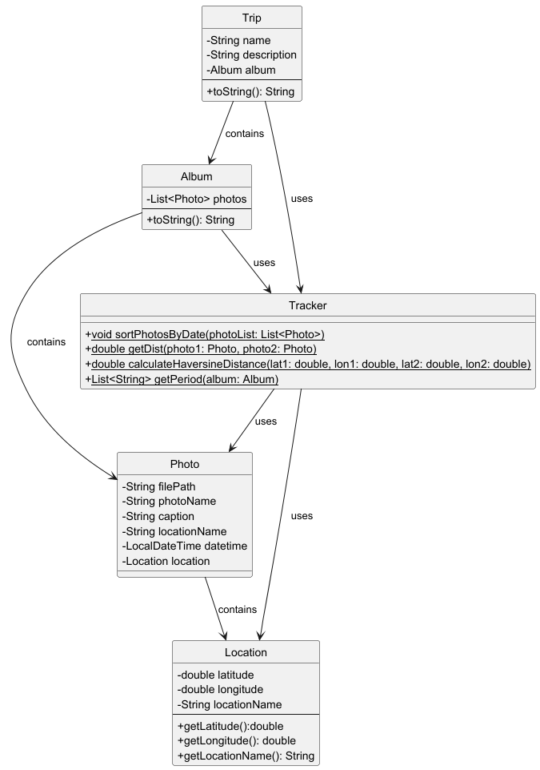
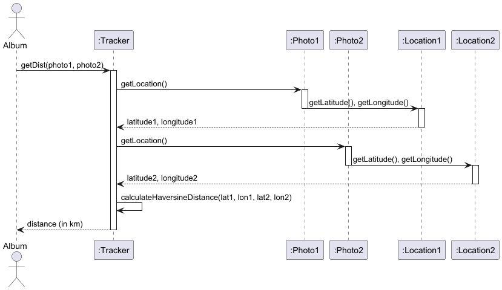

# Developer Guide
## Acknowledgements

## Setting up, getting started

### Prerequisites

- **JDK 17**
- **Gradle 7.6.2 or higher**

> ⚠️ **Caution:** Follow the steps in this guide **precisely**. Deviating from the instructions may result in setup failure.
---
### 1. Fork and Clone
First, fork this repository to your GitHub account. Then, clone **your fork** to your local machine.
---
### 2. IntelliJ IDEA Setup (Highly Recommended)
#### 2.1 Configure the JDK

Follow the guide below to ensure IntelliJ IDEA is properly configured to use **JDK 17**:

➡️ [se-edu/guides: IDEA - Configuring the JDK](https://se-education.org/guides/tutorials/intellijJdk.html)

---

#### 2.2 Import the Project as a Gradle Project

Importing as a Gradle project is different from a normal Java project. Be sure to follow this guide carefully:

➡️ [se-edu/guides: IDEA - Importing a Gradle Project](https://se-education.org/guides/tutorials/intellijImportGradleProject.html)

> ⚠️ **Note:** Importing a Gradle project requires different steps from importing a standard Java project. Do not skip this step.

---

### 3. Verify the Setup

- Run `seedu.address.TravelDiary` and try out a few commands.
- Run the tests and ensure **all tests pass**.

✅ If both tasks succeed, your setup is complete!

## Design

# Architecture

## Architecture Diagram

The Architecture Diagram above explains the high-level design of the Travel Diary App.

Given below is a quick overview of main components and how they interact with each other.

## Main components of the architecture

**Main** (implemented in `TravelDiary` class) is in charge of the app launch and shut down.
* At app launch, it initializes the other components in the correct sequence and connects them with each other.
* At shut down, it saves data and invokes cleanup methods where necessary.

The bulk of the app's work is done by the following four components:

* **UI**: The UI of the App, implemented by `Ui` class.
* **Logic**: The command executor, implemented by `Command` classes and the `CommandFactory`.
* **Model**: Holds the data of the App in memory, primarily managed by `TripManager`.
* **Storage**: Reads data from, and writes data to the hard disk, implemented by the `Storage` class.

**Commons** represents a collection of classes used by multiple components, including exceptions and utility classes.

## How the architecture components interact with each other

### Component Interactions

The sequence diagram below shows a typical interaction flow when a user enters a command:


1. User enters a command through the **UI**
2. **Main** passes the command to the **Parser**
3. **Parser** processes the command and creates a command details map
4. **CommandFactory** creates the appropriate **Command** object
5. The **Command** is executed, potentially updating the **Model** (TripManager)
6. After command execution, any changes are saved via **Storage**
7. Results are displayed to the user through the **UI**

### State Management

The application uses a Finite State Machine (FSM) to track the user's current context:
* State 0: No trip selected
* State 1: Inside a specific trip

This state affects which commands are available and how they're processed.

## Component Details

### Main Component

The `TravelDiary` class:
* Initializes the UI, TripManager, and logging
* Loads existing trips from storage
* Processes user commands in a continuous loop until exit
* Saves all trips before exiting
* Manages the FSM state that tracks user context


### UI Component

The `Ui` class:
* Displays messages to the user
* Shows the current FSM state
* Presents welcome messages and command results
* Displays formatting elements like divider lines



The UI component:
* Handles all interactions with the user through a command-line interface
* Uses a Scanner to read user input and parse commands
* Maintains consistent display formatting with defined constants like SEPARATOR_LINE and PADDING
* Shows different interfaces based on FSM state (Trip Page or Photo Page)
* Displays a custom ASCII art logo stored in a text file

The UI follows a strict separation of concerns pattern:
* It only displays information and collects input
* It doesn't perform any processing of commands or business logic
* It receives formatted results from Command executions to display to the user
* It provides methods for both general display (`showToUser()`) and context-specific display (`showTripPage()`, `showPhotoPage()`)

This design ensures that UI changes can be made without affecting the core application logic.

### Logic Component

The Logic component consists of:
* **Parser**: Interprets user input into structured command details
* **CommandFactory**: Creates appropriate Command objects based on parsed input
* **Command** classes: Execute specific functionality and update the FSM state

Commands are executed based on the current FSM state, ensuring context-appropriate behavior.


#### Parser

####
- Contains static classes
- Parse input based on tags
- Return hashmap based on command name and tags

#### Parsing Input
The parsing process convert input and return hashmap which will be processed by CommandFactory.


The sequence diagram above illustrates how the `saveTasks` method processes a list of Trip objects:

1. The parsing will be split by space and tags
2. The return value for this parsing will be a hashmap <String, String>
3. The hashmap will be process to CommandFactory which will return the corresponding command

#### Command Sequence
The hashmap will be process based on its Command key value in the hashmap


The sequence diagram above illustrates how the `saveTasks` method processes a list of Trip objects:

1. The hashmap will always have a key `"command"`
2. The value of hashmap.get(`"command"`) will be the commandName eg. `"list"`
3. This value will be used to get the corresponding command eg. `ListCommand`


### Model Component

The `TripManager` class:
* Stores and manages all trips
* Maintains the current selected trip
* Provides methods to manipulate trips and their contents


#### Photo

####
- Stores image data with file paths and captions.

- Extracts metadata from image files using PhotoMetadataExtractor.

- Links each photo to a specific Location.

- Supports comparison of photos by datetime using PhotoDateTimeComparator.

- Can be displayed using PhotoPrinter.


### Storage Component

#### Overview
The **Storage** component is responsible for managing the persistence of application data, specifically trip details, photos, and albums. It facilitates saving data to a text-based file and loading it back into the application as needed. This component plays a critical role in ensuring the application's data remains intact across sessions.

#### Component Structure
The **Storage** component consists of several key classes that interact with each other to manage saving and loading data. Below is the class diagram for the **Storage** component.


#### Design Considerations

##### Data Format
The Storage component uses a text-based format with the following markers:
- `TRIP_MARKER ("T")`: Marks the beginning of trip data
- `PHOTO_MARKER ("P")`: Marks photo data
- `ALBUM_MARKER ("A")`: Marks album data
- `DELIMITER (" | ")`: Separates fields within a data entry

##### Exception Hierarchy
The component uses a specialized hierarchy of exceptions that provide specific information about issues:
- **FileReadException**: For issues reading the data file
- **FileWriteException**: For problems writing to the file
- **FileFormatException**: For invalid file format
- **TripLoadException**: For problems loading a specific **Trip**
- **PhotoLoadException**: For issues loading a specific **Photo**
- **PhotoSaveException**: For issues saving a **Photo**

### Commons

The Commons includes:
* **Exception classes**: Handle various error conditions (`InvalidIndexException`, `CommandNotRecogniseException`, etc.)
* **PhotoPrinter**: Manages photo display functionality
* **Logger**: Provides application-wide logging

### Design Considerations

### Persistence

The application saves data after each command to ensure data is not lost in case of unexpected termination.

### Error Handling

Robust exception handling ensures that:
* File-related errors are properly reported
* Command parsing errors are gracefully handled
* Invalid operations based on FSM state are prevented

### Extensibility

The architecture allows for easy extension:
* New commands can be added by implementing the Command interface
* Additional storage formats can be supported by extending the Storage component
* The FSM can be expanded to support more complex workflows


## Implementation

### Storage Component
The **Storage** component is implemented as a utility class with static methods for interacting with persistent storage. It employs the custom text file format described in the design section.

#### Key Operations

##### Saving Data
The saving process involves converting in-memory objects into a textual representation and writing them to a file. The `saveTasks` method is responsible for managing this process.

The **sequence diagram** below illustrates how the `saveTasks` method handles saving data for a list of **Trip** objects:



The process follows these steps:
1. Each **Trip** is serialized into a string line prefixed with the "T" marker.
2. If a **Trip** contains an **Album**, the album is serialized with the "A" marker.
3. For each **Photo** in the **Album**, the photo's details are serialized with the "P" marker.
4. The formatted data is written to the output file.

##### Loading Data
The loading process reads the text-based storage file line by line, reconstructing the corresponding in-memory objects. The `loadTrips` method is responsible for this operation.

The **sequence diagram** below shows how the `loadTrips` method processes the data:



The process follows these steps:
1. The file is read line by line.
2. Each line is analyzed by its marker (T, A, or P) to determine its type.
3. For **Trip** lines (T), a new **Trip** object is created via **TripManager**.
4. For **Album** lines (A), the **Album** is assigned to the current **Trip**.
5. For **Photo** lines (P), a new **Photo** object is created and added to the associated **Album**.
6. Errors are handled by throwing appropriate exceptions.

#### Special Handling

##### Encoding and Decoding
The **Storage** component ensures that special characters which could interfere with the file format are correctly encoded and decoded during the read and write operations:

- The pipe character (`|`) is encoded as `\pipe`
- Newline characters are encoded as `\newline`

This encoding guarantees that special characters in the data do not disrupt the file format.

##### Error Management
The exception handling system addresses various error scenarios during file operations:
- Provides specific error messages with context
- Includes the location of the failure
- Details the type of issue encountered to facilitate troubleshooting
  Got it! Here's the Markdown version of the Tracker documentation and TrackerCalculateDistanceProcess using proper headings with `###` for labels and clarity:

---
## Photo Component

#### Overview
The **Photo** component is responsible for representing and managing metadata and geographical information about a photo. It acts as a core data structure that stores attributes like file path, caption, and location, and integrates with external tools for extracting metadata from photos.

### Component Structure
The **Photo** component includes multiple related classes and interactions, as shown in the class diagram below:


### Design Considerations

#### Metadata Management
The **Photo** component uses the `PhotoMetadataExtractor` class to extract relevant metadata (e.g., location and datetime) from image files. This ensures that all information is kept consistent and valid.

#### Location Representation
The geographical location of a photo is represented using the `Location` class, which encapsulates latitude and longitude. This design allows modular and extensible handling of location data.

#### Exception Handling
- Validates input attributes like `filePath` to ensure non-null and well-formatted data.
- Handles scenarios where metadata cannot be extracted, throwing meaningful exceptions for better traceability.

---

## AddPhotoProcess

### Sequence Diagram
The **sequence diagram** below illustrates how the `AddPhotoCommand` interacts with other components to add a photo to a trip:



### Key Steps in the Process
1. **TravelDiary** initiates the process by calling the `AddPhotoCommand` constructor with a `filePath`, `photoName`, and `caption`.
2. The `execute` method is called on the `AddPhotoCommand`, passing the `TripManager`, `UI`, and `fsmValue`.
3. If the `TripManager` is null, a `TravelDiaryException` is logged and thrown.
4. If the `TripManager` is valid:
  - The `AddPhotoCommand` fetches the selected `Trip` via `getSelectedTrip()` from `TripManager`.
  - The `Trip` retrieves its associated `Album` using `getAlbum()`.

5. The **Album**:
  - Calls its `addPhoto()` method to create and add a new `Photo` object.
  - Instantiates a `Photo` object with the provided details (`filePath`, `photoName`, and `caption`).

6. The **Photo**:
  - Invokes `extractData()` to process the file and extract metadata via the `PhotoMetadataExtractor`.
  - The `PhotoMetadataExtractor` reads the metadata and returns details, including latitude and longitude.

7. The **Photo** uses the `Location` class to create an instance with extracted latitude and longitude.

8. The **Album** adds the photo to its `photos` list.

---

### Key Operations

#### Creating a Photo
The `Photo` class constructor follows this process:
1. Initializes with a `filePath`, `photoName`, and `caption`.
2. Calls the `extractData()` method to process the image file.
3. Validates extracted metadata and initializes associated attributes like `Location`.

#### Extracting Metadata
- The `PhotoMetadataExtractor` uses a `getMetadataMap()` method to process the image file and return a map of metadata values.
- Latitude and longitude are extracted and encapsulated in the `Location` class.

---

### Error Management
- If `TripManager` is null, the `AddPhotoCommand` logs an error and throws a `TravelDiaryException`.
- If the `Photo` file path or metadata are invalid, appropriate exceptions are raised during the creation and extraction process.
- All errors are logged with contextual information for debugging purposes.

---

### Implementation

#### AddPhotoProcess
The **AddPhotoProcess** is implemented as a sequence of commands that involve multiple components:
- `AddPhotoCommand`: Central command class managing the workflow.
- `TripManager`: Fetches the selected `Trip`.
- `Album`: Stores and organizes photos.
- `Photo`: Represents the photo with its metadata.
- `PhotoMetadataExtractor`: Extracts metadata from the photo file.
- `Location`: Represents the geographical coordinates of the photo.

#### Photo Component
The **Photo** component is implemented with methods for:
- **Creation:** `Photo(String filePath, String photoName, String caption)`
- **Data Extraction:** `void extractData(String filePath, LocalDateTime datetime)`
- **Interaction with Location:** `Location fromCoordinates(double latitude, double longitude)`

---

## Tracker Component

### Overview
The **Tracker** component serves as a utility module for operations related to photo data management. It is responsible for calculating distances between photo locations, sorting photos by date, and determining periods for albums. This component encapsulates logic for data analysis and simplifies operations involving geographic and temporal data.

### Component Structure
The **Tracker** component consists of static methods and does not maintain its own state. Below is the class diagram for the **Tracker** component:



### Design Considerations

#### Distance Calculation
The **Tracker** uses the Haversine formula to calculate the geographical distance between two photos. This formula accounts for the Earth's curvature, ensuring accurate results for any two points on the globe. The calculation uses:
- Latitude and longitude coordinates of two photo locations.
- A constant for Earth's radius: `EARTH_RADIUS = 6371` (in kilometers).

#### Sorting Photos
The component provides functionality to sort photos by their `datetime` attribute, leveraging the `PhotoDateTimeComparator`.

#### Period Calculation
The **Tracker** determines the date range of an album by analyzing the minimum and maximum `datetime` values among the photos in the album.

#### Exception Handling
The **Tracker** ensures robust exception handling for all operations:
- Validates that `Photo` objects have valid `Location` and `datetime` data.
- Ensures geographic coordinates are within valid ranges:
  - Latitude: `[-90, 90]`
  - Longitude: `[-180, 180]`.

---

## Tracker Calculate Distance Process

### Sequence Diagram
The **sequence diagram** below illustrates the process for calculating the distance between two photos using the `Tracker` component:



### Key Steps in the Process
1. **Album** initiates the process by calling the `getDist` method of the **Tracker**, passing two **Photo** objects (`photo1` and `photo2`).
2. The **Tracker** retrieves the `Location` objects from both photos by invoking their `getLocation()` method.
3. It extracts the latitude and longitude of each photo using `getLatitude()` and `getLongitude()` from the respective `Location` objects.
4. The **Tracker** calculates the distance between the two points using the **Haversine formula**:
  - Computes the differences in latitude and longitude, in radians.
  - Applies the Haversine equation to calculate the great-circle distance.
5. The calculated distance (in kilometers) is returned to the **Album**.

---

### Key Operations

#### Calculating Distance
The `getDist` method follows this process:
1. Retrieve `Location` from both `Photo` objects.
2. Extract latitude and longitude from the `Location` objects.
3. Validate coordinate ranges.
4. Calculate the Haversine distance:
  - Formula:
    ```
    a = sin²(Δφ / 2) + cos(φ₁) ⋅ cos(φ₂) ⋅ sin²(Δλ / 2)
    c = 2 ⋅ atan2(√a, √(1 − a))
    distance = EARTH_RADIUS ⋅ c
    ```
5. Return the distance.

#### Validations
The following validations are performed:
- Ensure `Photo` objects are non-null and have valid `Location` data.
- Validate that latitude and longitude are within acceptable ranges.

---

### Error Management
The component ensures:
- Invalid `Location` or `Photo` data is logged and handled gracefully.
- Exceptional cases, such as null attributes or out-of-range coordinates, are flagged with detailed error messages.

---

### Implementation

#### Tracker Component
The **Tracker** component is implemented as a utility class with the following static methods:
- `sortPhotosByDate(List<Photo>)`: Sorts photos by their `datetime` field.
- `getDist(Photo photo1, Photo photo2)`: Calculates the distance between two `Photo` objects.
- `calculateHaversineDistance(double lat1, double lon1, double lat2, double lon2)`: Performs the distance calculation using the Haversine formula.
- `getPeriod(Album album)`: Retrieves the date range of an album.

---

## Apendix: Requirements
### Product scope
#### Target user profile

Roadtrippers, van lifers, backpackers, and long-distance drivers who want to document their journeys efficiently. These users value convenience, real-time tracking, and the ability to relive their trips through route history.


#### Value proposition
The app enables roadtrippers to seamlessly track their journeys on the go. It automatically logs their geographical location, records mileage between stops, and helps them organize rest stops and key travel moments. By reducing manual input, it ensures that travelers can focus on their experience while still capturing essential trip details effortlessly.

### User Stories

| Version | As a ...      | I want to ...                                        | So that I can ...                                               |
|---------|---------------|------------------------------------------------------|------------------------------------------------------------------|
| v1.0    | new user      | see usage instructions                              | refer to them when I forget how to use the application          |
| v1.0    | user          | add a trip with a name and description              | record and organize my travel plans                             |
| v1.0    | user          | list all my trips                                   | view all the trips I've recorded                                |
| v1.0    | user          | select a trip                                       | manage the photos associated with that trip                     |
| v1.0    | user          | delete a trip                                       | remove trips I no longer want to keep                           |
| v1.0    | user          | add a photo with details                            | store visual memories along with meaningful captions            |
| v1.0    | user          | list all photos in a trip                           | review all my memories from a particular trip                   |
| v1.0    | user          | view details of a selected photo                    | see information like location, time, and caption                |
| v1.0    | user          | delete a photo from a trip                          | clean up photos I no longer want                                |
| v1.0    | user          | return to the main menu                             | navigate easily back to manage other trips                      |
| v2.0    | user          | get help on commands                                | learn how to use specific features                              |
| v1.0    | user          | exit the application                                | close the program when I'm done                                 |
| v2.0    | advanced user | access and edit the saved data file manually        | make bulk edits or backups directly from the storage file       |
| v2.0    | user          | get notified about missing fields when adding items | fix input errors immediately and avoid confusion                |

### Non-Functional Requirements

This application works on any computers that are Windows, macOS or Unix that has Java17.

### Glossary
* Trip - A user-defined journey or travel event that includes details such as start/end points, duration, and associated albums or photos.
* Album - A collection of photos linked to a specific trip, used to organize visual memories captured during the journey.
* Photo - An image file with metadata (e.g., caption, location, timestamp) that documents a specific moment within a trip.
* PhotoFrame - A graphical component responsible for rendering a photo and its metadata in a visually appealing layout.
* TripManager - A utility class or module responsible for creating and managing Trip objects during data loading and application runtime.


## Appendix: Instructions for Manual Testing

These instructions provide a systematic approach to manually test the Travel Diary application. Each test case describes the steps to perform and the expected outcome.

---

### Launch and Shutdown

#### Initial launch

1. Download the jar file and copy it into an empty folder
2. Run the command `java -jar Travel_Diary.jar` in your terminal or command prompt  
   **Expected:** The CLI displays the welcome message and shows the Trip Page interface with empty trip list or sample trips

#### Shutdown

- Type `bye` and press Enter  
  **Expected:** The application terminates and closes the terminal window or returns to command prompt

---

### Trip Management

#### Adding a trip

**Prerequisites:** Be on the Trip Page

- **Test case:** `add_trip n#Bali Trip d#Summer vacation`  
  **Expected:** A new trip is added. Success message shows the trip details. Trip list is updated with the new trip.

- **Test case:** `add_trip n#Weekend Getaway`  
  **Expected:** No trip is added. Error message indicates missing description tag.

- **Test case:** `add_trip d#Solo trip`  
  **Expected:** No trip is added. Error message indicates missing name tag.

- **Other incorrect commands to try:** `add_trip`, `add_trip n#`, `add_trip d#`, `add_trip n# d#`  
  **Expected:** Error messages explaining the correct format.

#### Listing trips

**Prerequisites:** At least one trip added

- **Test case:** `list`  
  **Expected:** All trips are displayed with their IDs, names, and brief descriptions.

- **Test case:** Execute `list` after adding multiple trips  
  **Expected:** The newly added trips appear in the list in the order they were added.

#### Selecting a trip

**Prerequisites:** List all trips using the `list` command. Multiple trips in the list.

- **Test case:** `select 1`  
  **Expected:** First trip is selected. Application navigates to the Photo Page. Trip details are shown at the top.

- **Test case:** `select 0`  
  **Expected:** No trip is selected. Error message indicates invalid index.

- **Test case:** `select [index larger than list size]`  
  **Expected:** No trip is selected. Error message indicates invalid index.

- **Other incorrect commands to try:** `select`, `select x` (where x is not a number)  
  **Expected:** Error messages explaining the correct format.

#### Deleting a trip

**Prerequisites:** List all trips using the `list` command. Multiple trips in the list.

- **Test case:** `delete 1`  
  **Expected:** First trip is deleted from the list. Success message shows deleted trip details.

- **Test case:** `delete 0`  
  **Expected:** No trip is deleted. Error message indicates invalid index.

- **Test case:** `delete [index larger than list size]`  
  **Expected:** No trip is deleted. Error message indicates invalid index.

- **Other incorrect commands to try:** `delete`, `delete x` (where x is not a number)  
  **Expected:** Error messages explaining the correct format.

---

### Photo Management

#### Adding a photo

**Prerequisites:** Select a trip and be on the Photo Page

- **Test case:** `add_photo f#/path/to/existing/photo.jpg n#Beach Day c#Beautiful sunset`  
  **Expected:** A new photo is added to the trip. Success message shows the photo details.

- **Test case:** `add_photo f#/path/to/nonexistent/file.jpg n#Beach Day c#Beautiful sunset`  
  **Expected:** No photo is added. Error message indicates file not found.

- **Test case:** `add_photo n#Beach Day c#Beautiful sunset`  
  **Expected:** No photo is added. Error message indicates missing file path tag.

- **Other incorrect commands to try:** `add_photo`, `add_photo f#`, `add_photo n#`, `add_photo c#`  
  **Expected:** Error messages explaining the correct format.

#### Listing photos

**Prerequisites:** Be on the Photo Page with at least one photo added

- **Test case:** `list`  
  **Expected:** All photos in the current trip are displayed with their IDs, names, captions, and locations.

- **Test case:** Execute `list` after adding multiple photos  
  **Expected:** The newly added photos appear in the list in the order they were added.

#### Selecting a photo

**Prerequisites:** List all photos using the `list` command. Multiple photos in the list.

- **Test case:** `select 1`  
  **Expected:** First photo is selected. Photo details are displayed, including name, caption, and location.

- **Test case:** `select 0`  
  **Expected:** No photo is selected. Error message indicates invalid index.

- **Test case:** `select [index larger than list size]`  
  **Expected:** No photo is selected. Error message indicates invalid index.

- **Other incorrect commands to try:** `select`, `select x` (where x is not a number)  
  **Expected:** Error messages explaining the correct format.

#### Deleting a photo

**Prerequisites:** List all photos using the `list` command. Multiple photos in the list.

- **Test case:** `delete 1`  
  **Expected:** First photo is deleted from the trip. Success message shows deleted photo details.

- **Test case:** `delete 0`  
  **Expected:** No photo is deleted. Error message indicates invalid index.

- **Test case:** `delete [index larger than list size]`  
  **Expected:** No photo is deleted. Error message indicates invalid index.

- **Other incorrect commands to try:** `delete`, `delete x` (where x is not a number)  
  **Expected:** Error messages explaining the correct format.

#### Closing a photo

**Prerequisites:** Select a photo using the `select [INDEX]` command

- **Test case:** `close`  
  **Expected:** The photo view is closed, returning to the photo list view.

- **Test case:** Execute `close` without selecting a photo  
  **Expected:** Error message indicates no photo is currently selected.

---

### Navigation

#### Returning to main menu

**Prerequisites:** Be on the Photo Page

- **Test case:** `menu`  
  **Expected:** Application navigates back to the Trip Page. Trip list is displayed.

- **Test case:** Execute `menu` while already on the Trip Page  
  **Expected:** Error message indicates you are already on the Trip Page.

#### Help command

- **Test case:** `help` on Trip Page  
  **Expected:** Displays all available commands for the Trip Page.

- **Test case:** `help` on Photo Page  
  **Expected:** Displays all available commands for the Photo Page.

---

### Data Persistence

#### Saving data

**Prerequisites:** Add several trips and photos

- **Test case:** Exit the application using `bye` and restart it  
  **Expected:** All previously added trips and photos are loaded and displayed.

#### Dealing with missing/corrupted data files

**To simulate a missing data file:**

1. Run the application once to generate the data file
2. Exit the application
3. Delete or rename the data file in the `/data` folder
4. Restart the application  
   **Expected:** A new empty data file is created. Application starts with no trips.

**To simulate a corrupted data file:**

1. Run the application once to generate the data file
2. Exit the application
3. Open the data file in a text editor and modify it to make it invalid JSON
4. Restart the application  
   **Expected:** Application attempts to load the file, detects corruption, and either creates a new empty data file or displays an error message explaining the issue with the data file.

---

### Edge Cases

#### Long inputs

- **Test case:** Add a trip with an extremely long name and description  
  `add_trip n#[300 character name] d#[500 character description]`  
  **Expected:** Trip is added successfully, with text potentially truncated in the display.

#### Special characters

- **Test case:** Add a trip with special characters in the name and description  
  `add_trip n#My Trip!@#$%^&*() d#Special chars: !@#$%^&*()`  
  **Expected:** Trip is added successfully with all special characters preserved.

#### Case sensitivity

- **Test case:** Try commands with different capitalization  
  `ADD_TRIP n#Test Trip d#Test Description`  
  `Add_Trip n#Test Trip d#Test Description`  
  **Expected:** Commands are recognized regardless of case.

#### Empty list operations

- **Test case:** Execute `list`, `select 1`, and `delete 1` on an empty trip list  
  **Expected:** `list` shows empty list message, `select` and `delete` show error messages.

#### Concurrent modification

- **Test case:** Modify the data file while the application is running
    1. Run the application
    2. Manually edit the data file in a text editor
    3. Perform operations in the application  
       **Expected:** Changes made in the application overwrite manual changes to the file.
